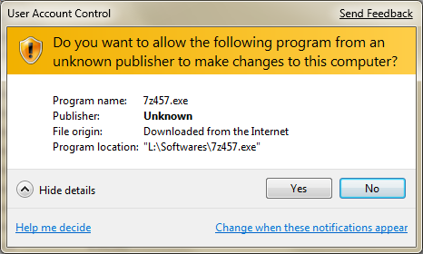

# GamePerformanceReporter.Client #

Game Performance Reporter Client is a Windows application to monitor 3D (possibly 2D) performance primarily within video games. The intent of this application is to troubleshoot performance and provide basic analysis.

# Motivations #

As the author I play a video game called PlanetSide 2.  It unfortunately has a problem where performance drops frequently and without much explanation.  After much swearing and frustration I decided to take it out on my keyboard rather than virtual soldiers. So I built this app. I probably spent more time developing this rather than actually playing the game, but I learned a lot from it.

# What you can do with it #

Well first off it wont fix anything, it will just track the performance of the video game for you to analyze later.  One thing you can do it set a "Suspected Issue Hotkey" (I suggest a key that you do not use often).  The "Hotkey" will take a picture of the current graph, and video game window (Only works in Windowed Mode not Full Screen).  These two images will be save to the desktop.

 

# Examples #

# Requirements #
- Microsoft .NET 4.5 Client Profile
- MSI Afterburner
- PlanetSide 2

# Downloads #

You can download from here: http://client.gpr.ilopez.com/latest/GamePerformanceReporter.zip

# Change Log #

## 2014-03-13 ##
- Added support for Minecraft and Star Wars Empire At War - Forces of Corruption
- Added exception handling for screenshots
- Tweaked hitch minimum trigger time and average sample rate
- Downloads will now be ZIPd

# Additional Notes #

You may be prompted to allow this application to make changes.  This is because I need to determine if MSI Afterburner is running, and to search the whole process list I need Administrator access.  However, it does not change anything on your system.

It would look similar to this:

Do not download this app from anywhere except the link above.  I cannot guarantee it was not tampered with.  Later I will provide signed builds for verification.

# Where To Get Help #

Please submit issues or feature requests to the GitHub "issues" page.
https://github.com/ilopez/GamePerformanceReporter.Client/issues

# Source #

The source for this application is available here:
https://github.com/ilopez/GamePerformanceReporter.Client

# The License #

This application and source is licensed under the Apache 2 License. 

Additional software included in the latest build is provided under expressed permission by its author:

- MSI Afterburner .NET Library - Nick Connors

# Limitation of Liability #

There is no implied warranty, and the software is distributed AS-IS.

In no event shall Israel Lopez be liable to you or any party related to you for any indirect, incidental, consequential, special, exemplary, or punitive damages or lost profits, even if Israel Lopez has been advised of the possibility of such damages.
In any event, Israel Lopez total aggregate liability to you for all damages of every kind and type (regardless of whether based in contract or tort) shall not exceed the purchase price of the product.  Which is zero.

